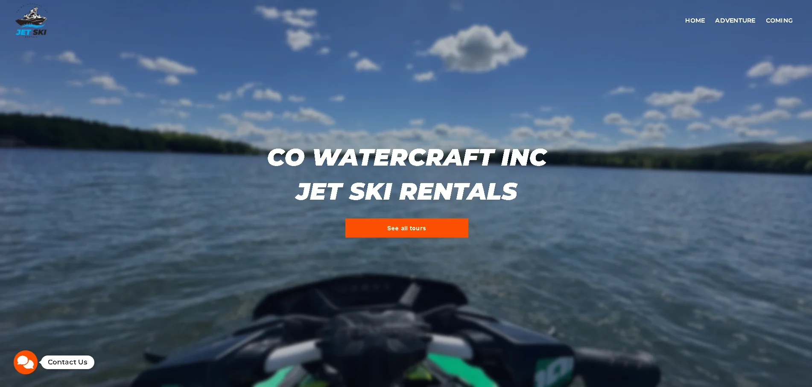

# 💼 Co Watercraft

It is a project (in progress) that seeks to showcase the services and products available, with various ways to contact them.

---

## 📌 Description
This is a web application designed and developed to serve as a digital showcase for the company services and products.
The primary goals of this project were to:
- Clearly and attractively present a catalog of services and products.
- Implement a fully responsive design to ensure an optimal user experience on any device.
- Integrate multiple and accessible contact options to facilitate direct and effective communication with potential clients.

---

## 🛠 Technologies used
- **Angular 17** (framework)  
- **TypeScript** (logic and structure)  
- **JavaScript (ES6+)** (interactivity)  
- **HTML5** (markup)  
- **CSS3** (styling and responsive design)  
- **Visual Studio Code** (development environment)  
- **Vercel** (deployment and hosting)  

---

## ✨ Features
- Responsive and modern design  
- Custom-built components from scratch  
- Clean and organized project structure  
- Optimized performance for deployment on Netlify  

---

## 🌐 Live Demo
You can view the live version of this portfolio here:
👉 [cowatercraft.com/](https://www.cowatercraft.com/)

---

## 📸 Preview


---

## 📁 Structure
```bash
/portfolio
│
├── src
│   ├── app
│   │   ├── Modules
│   │   │   └── index
│   │   │       ├── components
│   │   │       │   ├── about
│   │   │       │   ├── carousel
│   │   │       │   ├── contact
│   │   │       │   ├── exp-progress
│   │   │       │   ├── experience
│   │   │       │   ├── footer
│   │   │       │   ├── formation
│   │   │       │   ├── gitprev
│   │   │       │   ├── index
│   │   │       │   ├── navbar
│   │   │       │   ├── polygon-skills
│   │   │       │   ├── profile
│   │   │       │   └── projects
│   │   │       └── index.module.ts
│   │   ├── services
│   │   │   ├── gitprev.service.ts
│   │   │   └── theme.service.ts
│   │   ├── app-routing.module.ts
│   │   ├── app.component.html
│   │   ├── app.component.scss
│   │   ├── app.component.ts
│   │   └── app.module.ts
│   ├── assets
│   ├── index.html
│   └── main.ts
│
├── angular.json
├── package.json
├── tsconfig.app.json
├── tsconfig.json
└── README.md
```
